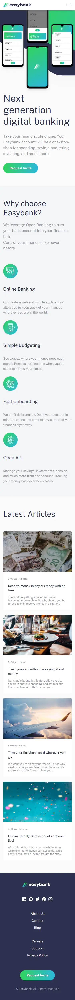
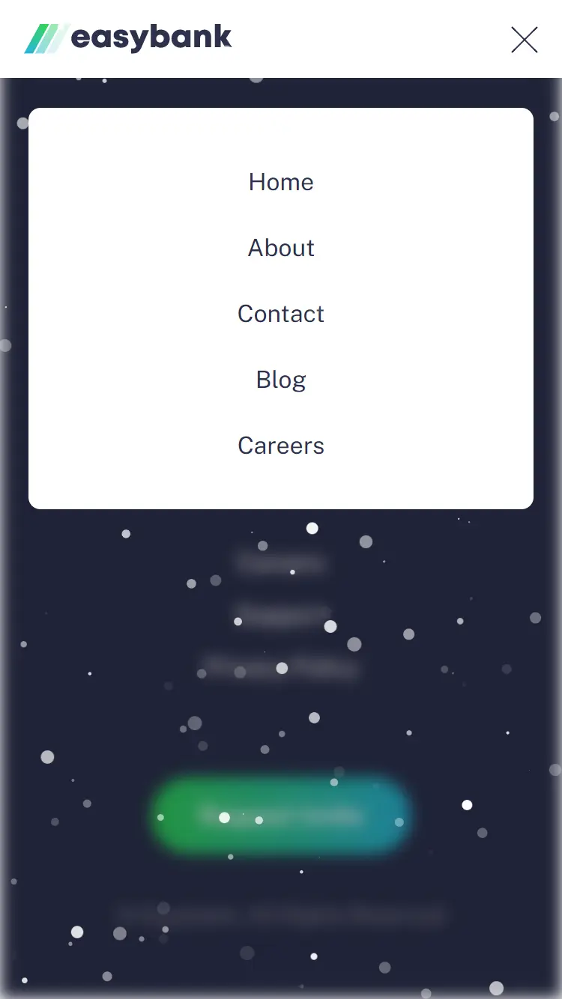
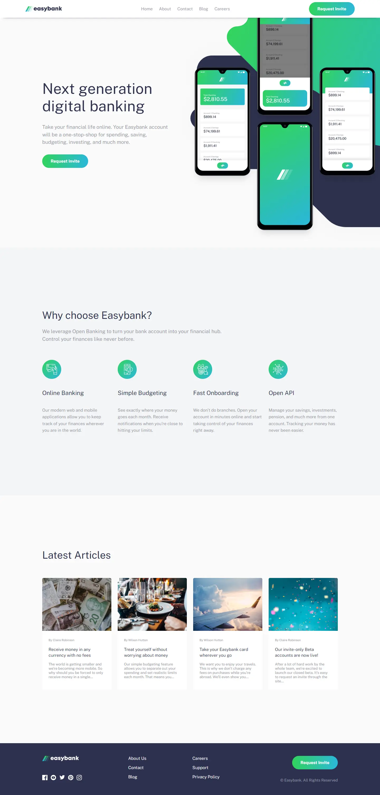

# Frontend Mentor - Easybank landing page solution

This is a solution to the [Easybank landing page challenge on Frontend Mentor](https://www.frontendmentor.io/challenges/easybank-landing-page-WaUhkoDN). Frontend Mentor challenges help you improve your coding skills by building realistic projects. 

## Table of contents

- [Frontend Mentor - Easybank landing page solution](#frontend-mentor---easybank-landing-page-solution)
  - [Table of contents](#table-of-contents)
  - [Overview](#overview)
    - [The challenge](#the-challenge)
    - [Screenshot](#screenshot)
    - [Links](#links)
  - [My process](#my-process)
    - [Built with](#built-with)
  - [Author](#author)

## Overview

### The challenge

Users should be able to:

- View the optimal layout for the site depending on their device's screen size
- See hover states for all interactive elements on the page

### Screenshot

Mobile Version

Desktop Version

### Links

- Solution URL: [GitHub](https://github.com/StalinAM/easybank)
- Live Site URL: [StalinAM](https://stalinam.github.io/easybank/)

## My process

### Built with

- Semantic HTML5 markup
- CSS custom properties
- Flexbox
- CSS Grid
- JavaScript

## Author

- GitHub - [StalinAM](https://github.com/StalinAM)
- Frontend Mentor - [@StalinAM](https://www.frontendmentor.io/profile/StalinAM)
